# 🌤️ SkyCast — Enterprise-Grade Weather Intelligence

[](https://kotlinlang.org/)
[](https://developer.android.com/jetpack/compose)
[](https://developer.android.com/topic/architecture)
[](https://developer.android.com/training/dependency-injection/hilt-android)
[](LICENSE)

**SkyCast** is a high-performance, production-ready weather engine designed to bridge the gap between complex meteorological data and a premium user experience. Built with a "Security-First" mindset and a sophisticated Glassmorphism design language, it stands as a testament to modern Android engineering excellence.

---

## 📱 Try the App

📥 **[Download Latest Demo APK (v1.0.0)](https://github.com/Douaa0504/Weather_App/releases)**

---

## 📸 Preview

<p align="center">
  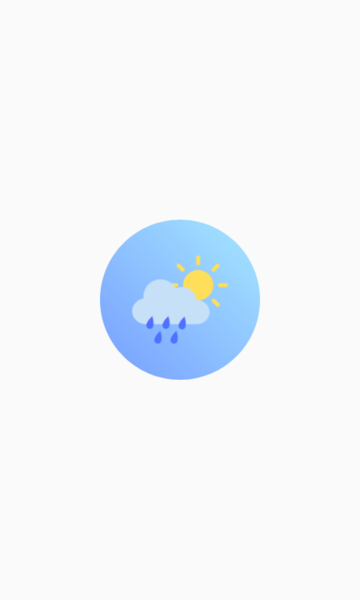
  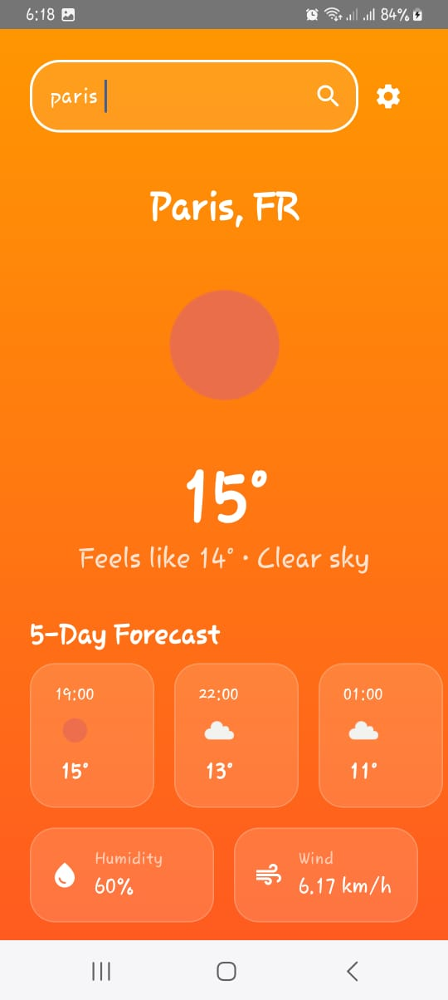
  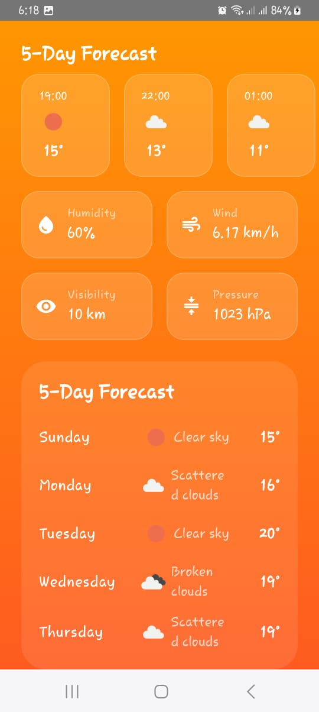
  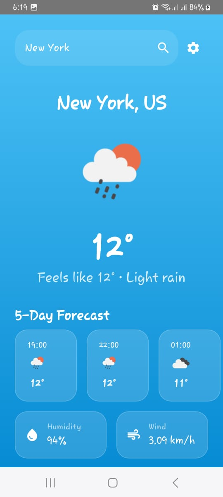
  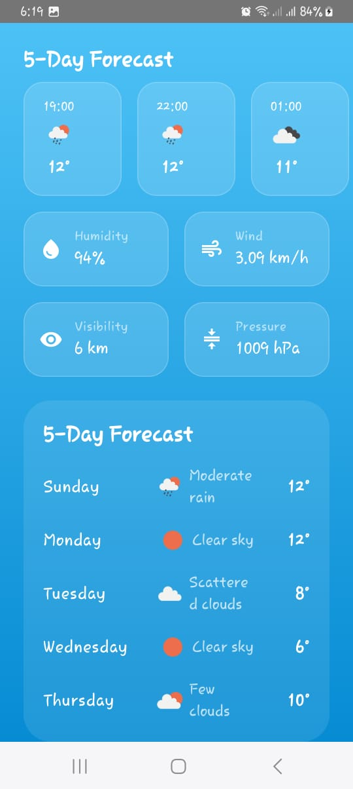  
  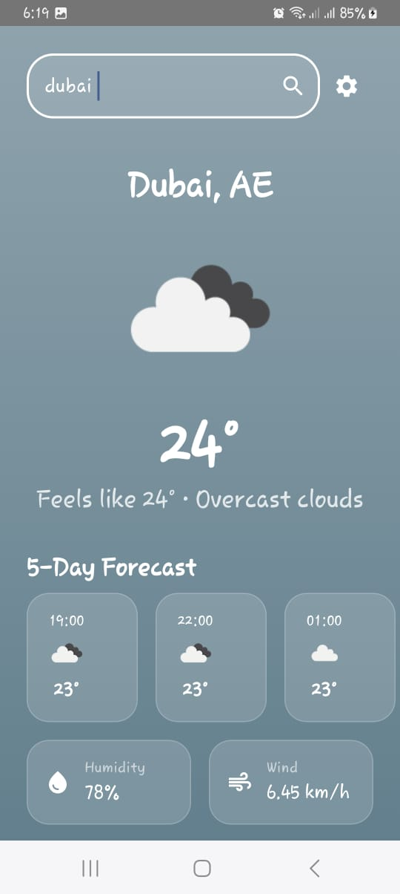  
  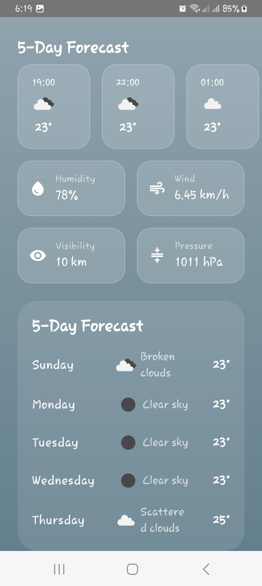
  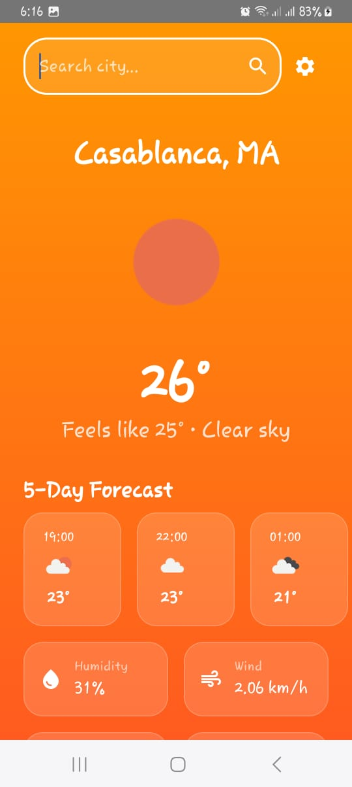
  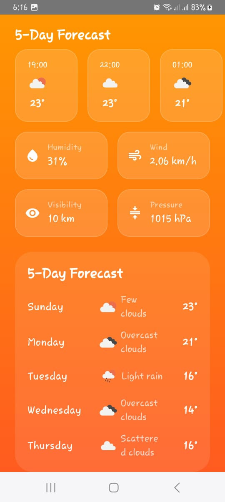
  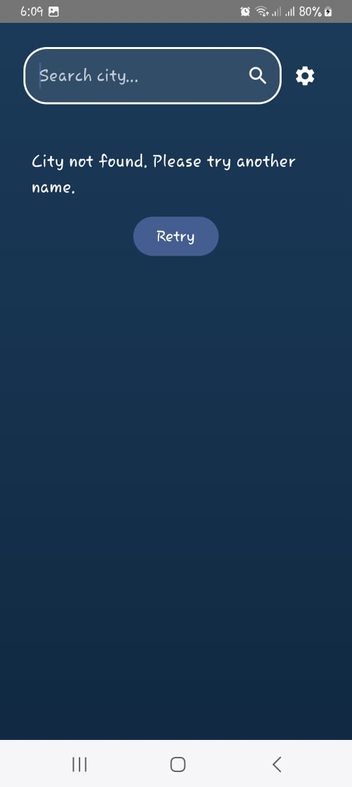
  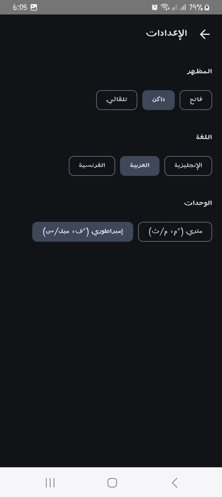
  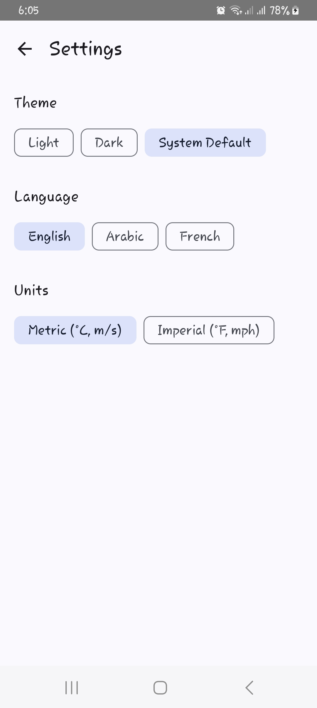
</p>

<p align="center">
  <i>Home Screen • Weather Details • Real-time Search • Dynamic Dark Mode</i>
</p>

---

## ✨ Features at a Glance

*   **🛰️ Precision Forecasting:** Real-time current conditions and granular 5-day forecasts via OpenWeatherMap API.
*   **🎨 Glassmorphism UI:** Sophisticated Material 3 design with translucent surfaces and weather-aware dynamic backgrounds.
*   **🌍 Elite Localization:** Full support for **English, Arabic (Native RTL), and French** with dynamic locale switching.
*   **📡 Intelligence Location:** Automated GPS detection using `FusedLocationProviderClient` with seamless edge-case handling.
*   **💾 Offline-First Strategy:** Robust local persistence via **Room Database**, ensuring 100% data availability offline.
*   **🔄 Resilient Networking:** Swipe-to-refresh architecture with intelligent error mapping and retry logic.

---

## 🛡️ Security Architecture

SkyCast is built with a rigorous **Security-First** approach to safeguard API credentials and enforce best coding practices.

*   **Zero-Hardcoding Policy:** API keys and sensitive credentials are never stored in the source code or version control.
*   **Credential Isolation:** Secrets are managed safely via a Git-ignored `local.properties` file.
*   **Gradle-Level Injection:** Sensitive keys are dynamically injected into the `BuildConfig` during compile-time.
*   **Clean Code Standards:** Enforced code quality guidelines ensuring safety and maintainability.

---

## 🏗️ Architecture: The Clean Standard

The codebase follows the **Clean Architecture** pattern, enforcing a strict separation of concerns that ensures the app is decoupled, testable, and maintainable at scale.

### Layer Breakdown
1.  **Presentation Layer:** State-driven UI using Jetpack Compose, `StateFlow`, and `ViewModel`.
2.  **Domain Layer (Core):** Pure Kotlin business logic containing atomic Use Cases and Repository Interfaces.
3.  **Data Layer:** Infrastructure implementation, coordinating between Retrofit (Remote) and Room (Local Cache).

```text
[Presentation] ──► [Domain (Use Cases)] ──► [Data (Repositories)]
🧰 Tech Stack
Language: Kotlin 2.0 (K2 Compiler)

UI Framework: Jetpack Compose (Material 3)

Dependency Injection: Hilt (Dagger)

Networking: Retrofit 2 + OkHttp 4

Database: Room Persistence Library

Asynchronous: Kotlin Coroutines & Flow

Image Loading: Coil

API: OpenWeatherMap API

🚀 Getting Started
Prerequisites
Android Studio Ladybug (2024.2.1) or newer.

A valid API Key from OpenWeatherMap.

Setup Instructions
Clone the Repository

Bash
git clone [https://github.com/Douaa0504/Weather_App.git](https://github.com/Douaa0504/Weather_App.git)
Configure Secrets
Create or open local.properties in your root directory and add:

Properties
OPENWEATHER_API_KEY=your_actual_api_key_here
Build and Deploy
Sync Gradle and run the :app module on your target device or emulator.

📂 Project Structure
Plaintext
├── app/src/main/java/com/erramidouaa/weatherapp
│   ├── data                # Network services, DAOs, and Repository Implementation
│   ├── di                  # Hilt Dependency Injection modules
│   ├── domain              # Pure Business Logic: Models, Use Cases, Interfaces
│   ├── presentation        # UI Logic: Compose Screens, ViewModels, Design System
│   └── util                # Reusable Helpers & Resource Wrappers
├── screenshots/            # App preview images
└── LICENSE                 # Open Source MIT License
🌍 Localization & Accessibility
Built for a global audience, SkyCast prioritizes accessibility:

Native RTL Support: Full layout mirroring for Arabic-speaking users.

I18n Excellence: 100% of strings are externalized for effortless translation.

Adaptive UI: Responsive layouts that scale across various screen densities and orientations.

🚧 Future Roadmap
[ ] Lottie Animations: Vector-based dynamic weather backgrounds.

[ ] Home Screen Widgets: Glanceable weather updates on home screen.

[ ] Interactive Charts: Visualizing temperature trends with custom Canvas components.

[ ] Expanded Test Coverage: Continuous addition of Unit and UI test suites.

📜 License
Distributed under the MIT License. See LICENSE for more information.

Developed by Douaa ERRAMI — Crafting Next-Generation Android Experiences.

⭐ Star this repository if you find it impressive!